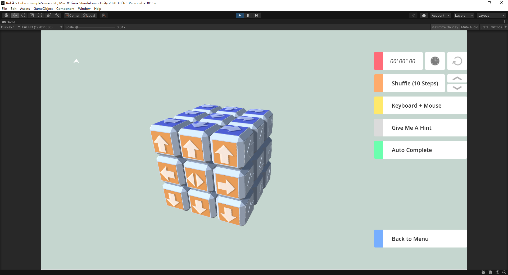
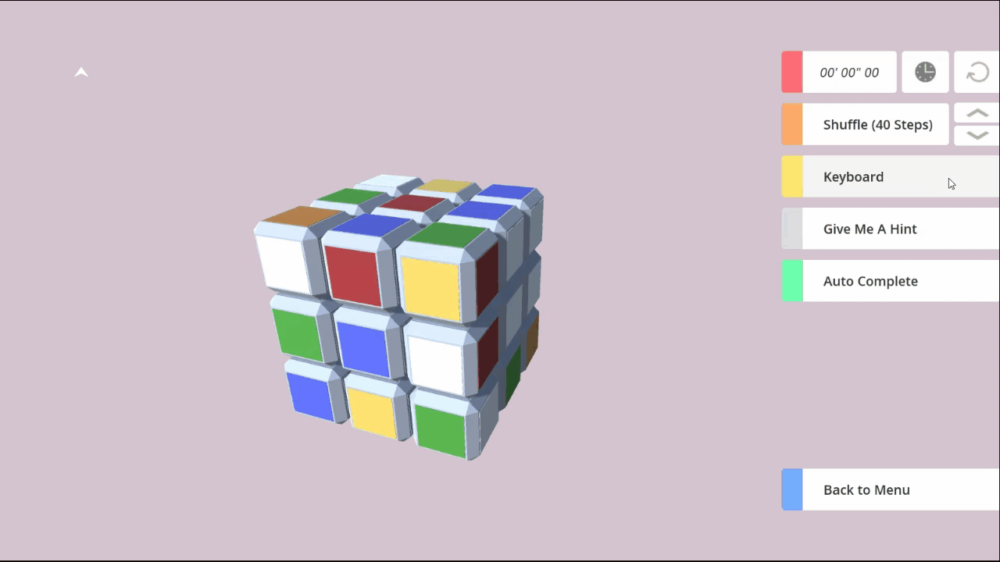

# Unity-Rubiks-Cube
A fairly simple Rubik's Cube simulation program, implementing in C# in the Unity game engine.

If you are using Mac (Big Sur), please run the following command after download the latest release:

``
  sudo chmod -R 755 Path\ to\ app\ file.app
``

# Develop Log

2021-03-29

Adding basic formulas.

2021-03-28

Complete interface design and keyboard control mode.
